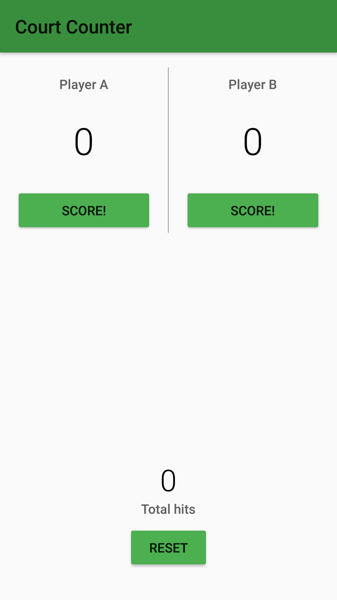

Feel free to browse this code in GitHub, or even import from repository in Android Studio! 

You can install app-debug.apk if you'd like to use the app yourself!

Note: I developed this some time ago (January/February 2017?) as part of the Udacity course Android for Beginners, as one of 10,000 scholars (forum/mentors accessible, video content remained same as the freely available videos) under Google's scheme.

